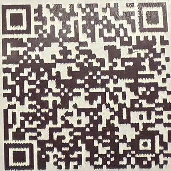
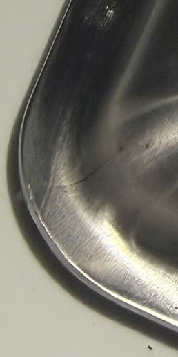

# IN LAI - HÓA ĐỒN THANH TOÁN

Số HD: 060153

Mā HD: #JE6QA

Bàn: A08 - KHU A

Glò vào : 11:24

TN: Thu Ngân Tôi Mipec

Tây Son

Ngày: 06/06/2026

Giò ra: 12:48

<table border="1"><tr><td>STT</td><td>Tên món</td><td>SL</td><td>Don giá</td><td>Thành tiện</td></tr><tr><td>1</td><td>Món cuǒn heo quay</td><td>1</td><td>189,000</td><td>189,000</td></tr><tr><td>2</td><td>Nöm bǎp bò rau càng cua Dà Năng</td><td>1</td><td>215,000</td><td>215,000</td></tr><tr><td>3</td><td>Rau bò khai xào tói</td><td>1</td><td>119,000</td><td>119,000</td></tr><tr><td>4</td><td>Vé Vào Cúra 59k</td><td>3</td><td>59,000</td><td>177,000</td></tr><tr><td>5</td><td>Nuóc khoáng Lavie 500ml</td><td>1</td><td>24,000</td><td>24,000</td></tr></table>

Tiên thuế(VAT: 8%): 57,920 g

Thành tiện VAT: 781,920 g

781,920 g

+Thanh toán (Chuyên khoán) 781,920

Bánh Tráng Thjt Heo Glang MỘ - MIPEC Tây Son

Đja chí: Tàng 2, Toà Nhà Mîpec 229 Tây Son,

Quân Đông Da, Hà Nội

Khách hàng: IPOS-O20 - 0972743096 -

Quả tăng uru dãi: Giang Mỹ güì tăng mā voucher

miên phí vê vào của khi quay lại trong 14 ngày, âp

dung tại co sơ Mipec Tây Son và Lê Văn Luong

Khách hàng vui lòng cung cấp thông tin xuát VAT

khị thanh toán. Hóa đơn chi xuát trong ngày

Quét mã QR duối đây để cung cấp thông tin hoá

đơn diên tù

(M mã QR này có hiệu lực trong vòng 2 giố)

